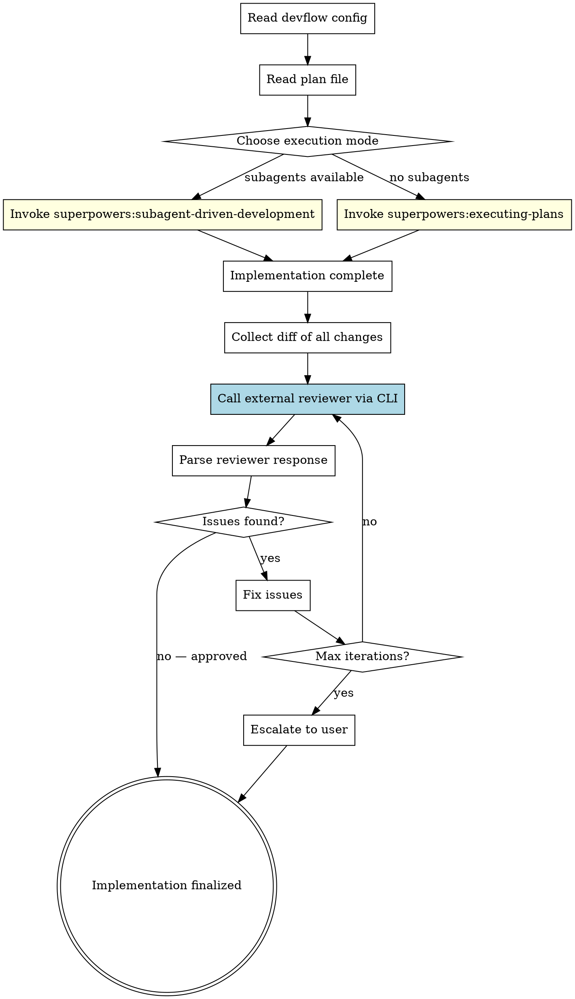

# Devflow: Implement

Implement a plan using superpowers' execution skills, then run an **external cross-tool review loop** to validate the implementation from a different AI perspective.

## When to Use

- User says "implement this plan" or "devflow:implement"
- User has a plan file ready and wants cross-reviewed implementation
- As Phase 2 of `devflow:run`

## Inputs

- **Plan file path**: path to the implementation plan (from user or Phase 1)
- **Autonomy mode**: `attended` (default) or `unattended`
- **Config**: `~/.devflow/config.yaml` or `.devflow.yaml`

## Process



## Step-by-Step

### Step 1: Read Config

Same as `devflow:plan` Step 1. Read reviewer config from `~/.devflow/config.yaml` or `.devflow.yaml`.

Extract these values (defaults shown):
- `reviewer.command`: `codex exec`
- `reviewer.flags`: `--full-auto`
- `reviewer.model`: `gpt-5.4`
- `reviewer.effort`: `xhigh`
- `implementer.model`: `gpt-5.4`
- `implementer.effort`: `high`
- `session_reuse`: `true`

Also check if a plan-review session exists from a prior `devflow:plan` run:
```bash
PLAN_SESSION_FILE="/tmp/devflow-plan-review.session"
if [ -f "$PLAN_SESSION_FILE" ]; then
  echo "Plan-review session available: $(cat $PLAN_SESSION_FILE)"
fi
```

### Step 2: Read and Validate Plan

```bash
cat "<plan-file-path>"
```

Verify:
- Plan file exists and is readable
- Plan has task structure (numbered tasks with steps)
- Plan references real files in the project

If plan is missing or invalid, ask user for the correct path.

### Step 3: Execute Plan (superpowers)

Choose execution mode based on platform capabilities:

**If subagents are available** (Claude Code, Codex with collab):
- **Invoke `superpowers:subagent-driven-development`**
- This handles: task dispatch, implementer subagents, spec review, code quality review, TDD

**If subagents are NOT available** (Windsurf, Gemini):
- **Invoke `superpowers:executing-plans`**
- This handles: sequential task execution with checkpoints

**Important**: Do NOT skip the superpowers execution skills. They handle TDD, self-review, and internal quality gates. Devflow adds the external cross-tool review on top.

### Step 4: Collect Changes

After implementation is complete, collect all changes for external review:

```bash
# Get the diff of all uncommitted changes
git diff HEAD --stat
git diff HEAD
```

If changes are committed (superpowers may auto-commit per task):
```bash
# Get diff from before implementation started
git log --oneline -10
git diff <start-commit>..HEAD
```

Save the diff to a temporary file for the reviewer:
```bash
git diff HEAD > /tmp/devflow-impl-diff.patch
# Or if committed:
git diff <start-commit>..HEAD > /tmp/devflow-impl-diff.patch
```

### Step 5: External Cross-Tool Review

Send the implementation to an external AI tool for review.

**First iteration — start new session (or resume plan-review session):**

```bash
DIFF=$(cat /tmp/devflow-impl-diff.patch)
PLAN=$(cat "<plan-file-path>")
SESSION_FILE="/tmp/devflow-impl-review.session"
OUTPUT_FILE="/tmp/devflow-impl-review-output.txt"
EVENTS_FILE="/tmp/devflow-impl-review-events.jsonl"
PLAN_SESSION_FILE="/tmp/devflow-plan-review.session"

MODEL_FLAGS='-m <reviewer.model> -c '\''model_reasoning_effort="<reviewer.effort>"'\'''

# Option A: Resume plan-review session (reviewer already knows the plan)
if [ -f "$PLAN_SESSION_FILE" ]; then
  SESSION_ID=$(cat "$PLAN_SESSION_FILE")
  <REVIEWER_COMMAND> resume "$SESSION_ID" <REVIEWER_FLAGS> \
    $MODEL_FLAGS -o "$OUTPUT_FILE" \
    "The plan you reviewed is now implemented. Review the code changes.

REVIEW CHECKLIST:
1. PLAN COMPLIANCE — implements everything in the plan?
2. CODE QUALITY — clean code, error handling, no bugs?
3. TESTING — adequate tests, edge cases?
4. PATTERNS — follows project conventions?
5. SECURITY — any concerns?

Respond: APPROVED or ISSUES (severity + file:line + fix).

Code changes (diff):
$DIFF"
  # Reuse the same session for subsequent iterations
  cp "$PLAN_SESSION_FILE" "$SESSION_FILE"

# Option B: Fresh session (no prior plan-review context)
else
  <REVIEWER_COMMAND> <REVIEWER_FLAGS> --json $MODEL_FLAGS \
    -o "$OUTPUT_FILE" \
    "You are reviewing a code implementation against its plan. READ-ONLY review.

REVIEW CHECKLIST:
1. PLAN COMPLIANCE — implements everything?
2. CODE QUALITY — clean, no bugs?
3. TESTING — adequate?
4. PATTERNS — project conventions?
5. SECURITY — concerns?

Respond: APPROVED or ISSUES (severity + file:line + fix).

Plan:
$PLAN

Code changes:
$DIFF" 2>/dev/null | tee "$EVENTS_FILE"
  head -1 "$EVENTS_FILE" | python3 -c "import sys,json; print(json.loads(sys.stdin.read())['thread_id'])" > "$SESSION_FILE"
fi
```

**Subsequent iterations — resume:**
```bash
SESSION_ID=$(cat "$SESSION_FILE")
<REVIEWER_COMMAND> resume "$SESSION_ID" <REVIEWER_FLAGS> \
  -o "$OUTPUT_FILE" \
  "Issues fixed. Re-review:\n$(git diff HEAD | head -c 50000)"
```

**Note on large diffs**: If the diff exceeds ~50KB, split the review by file groups.

### Step 6: Process Review Response

Same iteration logic as `devflow:plan` Step 4:

- **APPROVED**: Done, proceed to Step 7
- **ISSUES found**:
  - Fix critical and important issues
  - Re-run external review
  - Max 5 iterations, then escalate to user

When fixing issues, use the current tool's capabilities (edit files, run tests). Do NOT call the external tool for fixes — only for review.

**Implementation handoff**: If fixes are complex, you can resume the review session with implementer effort:
```bash
SESSION_ID=$(cat "$SESSION_FILE")
codex exec resume "$SESSION_ID" --full-auto \
  -m <implementer.model> -c 'model_reasoning_effort="<implementer.effort>"' \
  -o /tmp/devflow-impl-fix-output.txt \
  "Fix the issues you found in your review. Here are the files: ..."
```

### Step 7: Finalize

Save the implementation review report:

```bash
mkdir -p "<output_dir>"
cat > "<output_dir>/YYYY-MM-DD-<feature>-impl-review.md" << 'EOF'
# Implementation Review Report

**Feature**: <feature name>
**Plan**: <path to plan>
**Reviewer**: <tool name>
**Iterations**: <count>
**Result**: APPROVED / APPROVED_WITH_NOTES

## Changes Summary
<git diff --stat output>

## Review History
### Iteration 1
<reviewer response>
### Iteration 2 (if any)
<fixes made + reviewer response>

## Final Status
<summary>
EOF
```

Announce to user:
> "Implementation complete and cross-reviewed. Review report at `<report-path>`. Changes are in your working directory (not committed). Run `git diff --stat` to see all changes."

## Autonomy Modes

- **attended**: Pause after superpowers execution for user to inspect. Present external review findings before fixing.
- **unattended**: Execute plan fully, auto-fix review issues, only escalate on critical blockers.

## Key Rules

- **Superpowers handles execution** — devflow only adds the external review loop after
- **Never skip internal quality gates** — superpowers' TDD, spec review, and code quality review happen FIRST
- **External review is the final gate** — it catches things the internal review missed
- **Don't auto-commit** — leave changes in working directory unless user explicitly asks
- **Large diffs**: chunk the review if diff > 50KB to stay within CLI token limits
