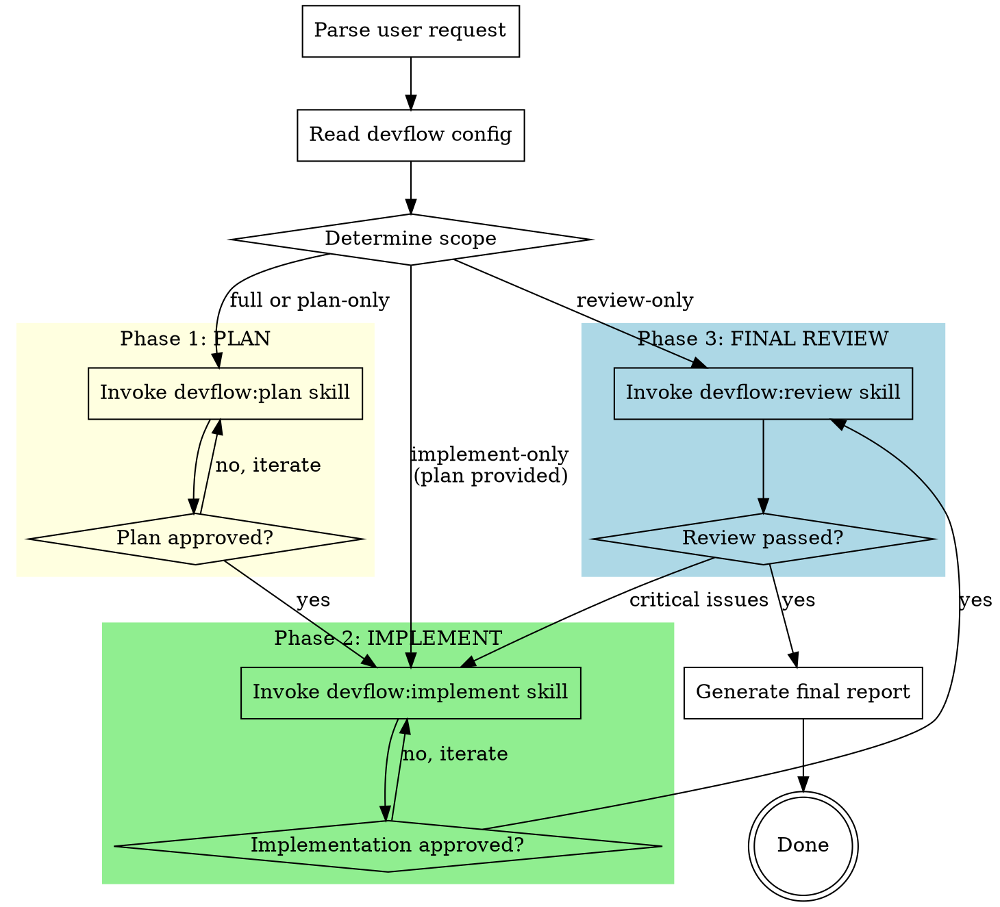

# Devflow: Run

Full development pipeline that orchestrates planning, implementation, and review across multiple AI tools. This is the "one command to rule them all" skill.

## When to Use

- User says "build this feature", "devflow:run", or "run the full pipeline"
- User describes a feature and wants it planned, implemented, and reviewed
- User wants hands-off development with cross-tool quality gates

## Inputs

- **Feature description**: what to build (from user)
- **Autonomy mode**: parsed from user request
  - Default (`attended`): ask user on ambiguity
  - `--unattended` or "don't ask me": never ask, best-effort decisions
  - Partial: "just plan" → only Phase 1, "just implement <plan>" → only Phase 2
- **Config**: `~/.devflow/config.yaml` or `.devflow.yaml`

## The Full Pipeline



## Step-by-Step

### Step 0: Parse Request and Config

**Parse the user's request to determine:**

1. **Feature description** — what to build
2. **Scope** — full pipeline, or specific phase(s):
   - "plan this" → Phase 1 only
   - "implement this plan" → Phase 2 only (requires plan file path)
   - "review my changes" → Phase 3 only
   - "build this" / "devflow:run" → all phases
3. **Autonomy** — from request or config:
   - "don't ask me" / "--unattended" → `unattended`
   - Default → `attended`

**Read config:**
```bash
cat ~/.devflow/config.yaml 2>/dev/null || echo "Using defaults"
cat .devflow.yaml 2>/dev/null || echo "No project override"
```

**Resolve the active backend** from the `backend` key (default: `claude`), then read
settings from the matching section (`claude.*` or `codex.*`):
- **Reviewer**: `<backend>.reviewer.model` + `<backend>.reviewer.effort`
- **Implementer**: `<backend>.implementer.model` + `<backend>.implementer.effort`
- **Orchestrator** (you): uses its own model (e.g., `opus-4.6` in Windsurf, whatever the host agent runs)
- **Session reuse**: `<backend>.session_reuse` (default: `true`)

**Create a TodoWrite/todo_list with phases to track progress.**

### Step 1: Phase 1 — PLAN (if in scope)

**Invoke the `devflow:plan` skill.** This skill handles:
- Superpowers brainstorming and writing-plans
- External cross-tool review of the plan
- Iteration until plan is approved

**Output**: Plan file path (e.g., `docs/superpowers/plans/YYYY-MM-DD-<feature>.md`)

**Session artifact**: After plan review completes, a session file exists at `/tmp/devflow-plan-review.session`. This carries context to Phase 2.

**In attended mode**: After plan is finalized, present summary to user:
> "Phase 1 complete. Plan saved to `<path>`. External review: APPROVED after N iterations. Proceed to implementation?"

**In unattended mode**: Proceed directly to Phase 2.

### Step 2: Phase 2 — IMPLEMENT (if in scope)

**Invoke the `devflow:implement` skill.** This skill handles:
- Superpowers subagent-driven-development or executing-plans
- External cross-tool review of implementation
- Iteration until implementation is approved

**Input**: Plan file from Phase 1 (or user-provided path)

**Session continuity**: `devflow:implement` automatically checks for `/tmp/devflow-plan-review.session` and resumes that session for code review — the reviewer already knows the plan and prior feedback.

**Output**: Code changes in working directory + review report

**In attended mode**: After implementation is approved, present summary:
> "Phase 2 complete. Implementation reviewed and approved. N files changed. Proceed to final review?"

**In unattended mode**: Proceed directly to Phase 3.

### Step 3: Phase 3 — FINAL REVIEW (if in scope)

**Invoke the `devflow:review` skill.** This skill handles:
- Internal code review (superpowers)
- External cross-tool review
- Combined report

**This is the final quality gate.** If critical issues are found:
- **attended**: Present to user for decision
- **unattended**: Attempt to fix and re-review (max 2 additional iterations)

### Step 4: Final Report

Generate a comprehensive report summarizing the entire pipeline:

```markdown
# Devflow Report: <feature name>

**Date**: YYYY-MM-DD
**Autonomy**: attended / unattended
**Orchestrator**: <current tool>
**External reviewer**: <tool name>

## Phase 1: Planning
- **Status**: ✅ Complete
- **Plan**: `<path>`
- **Review iterations**: N
- **Duration**: ~Xm

## Phase 2: Implementation  
- **Status**: ✅ Complete
- **Files changed**: N
- **Review iterations**: N
- **Duration**: ~Xm

## Phase 3: Final Review
- **Status**: ✅ Approved / ⚠️ Approved with notes
- **Critical issues**: 0
- **Important issues**: N (resolved)
- **Report**: `<path>`

## Summary
<1-2 sentence summary of what was built and its status>

## Next Steps
- Review changes: `git diff --stat`
- Run tests: `<test command from project>`
- Commit when satisfied
```

Create the output directory and save:

```bash
mkdir -p <output_dir>
```

Save to `<output_dir>/YYYY-MM-DD-<feature>-report.md`.

## Partial Execution Examples

| User says | Phases executed |
|-----------|----------------|
| "devflow:run — add caching for /skills" | 1 → 2 → 3 |
| "devflow:plan — add caching for /skills" | 1 only |
| "devflow:implement docs/plans/caching.md" | 2 → 3 |
| "devflow:review my staged changes" | 3 only |
| "devflow:run --unattended — add caching" | 1 → 2 → 3 (no user prompts) |

## Error Handling

| Error | Action |
|-------|--------|
| External tool CLI not found | Tell user to install it, suggest config change |
| External tool returns error | Retry once, then show error to user |
| External tool timeout | Default 5 min timeout, retry once |
| Plan file not found (Phase 2) | Ask user for path |
| Config file invalid YAML | Use defaults, warn user |
| Superpowers not installed | Tell user to install superpowers first |

## Key Rules

- **Phases are sequential** — plan before implement, implement before final review
- **Each phase is self-contained** — can run any phase independently
- **Never skip external review** — it's the core value proposition
- **Don't auto-commit** — changes stay in working directory
- **Report everything** — save reports for audit trail
- **Superpowers skills do the heavy lifting** — devflow orchestrates between tools
- **Model tiers matter** — `xhigh` for reviews (thorough), `high` for implementation (fast)
- **Session reuse saves tokens** — ~20k tokens saved per resumed iteration
