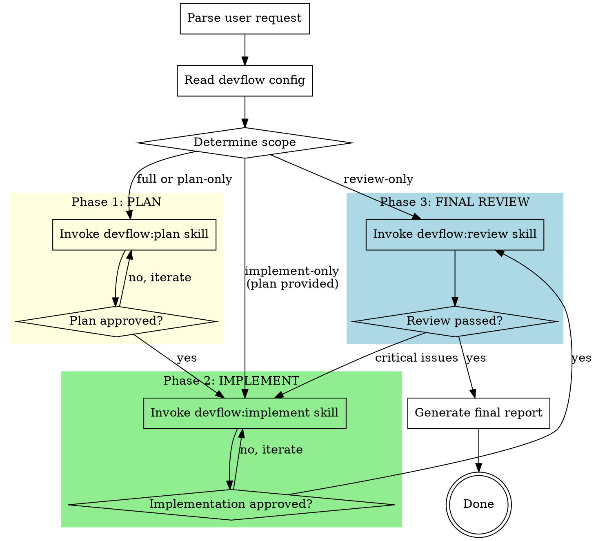

# Devflow: Run

Full development pipeline that orchestrates planning, implementation, and review across multiple AI tools. This is the "one command to rule them all" skill.

## When to Use

- User says "build this feature", "devflow:run", or "run the full pipeline"
- User describes a feature and wants it planned, implemented, and reviewed
- User wants hands-off development with cross-tool quality gates

## Inputs

- **Feature description**: what to build (from user)
- **Autonomy mode**: parsed from user request
  - Default (`attended`): ask user on ambiguity
  - `--unattended` or "don't ask me": never ask, best-effort decisions
  - Partial: "just plan" → only Phase 1, "just implement <plan>" → only Phase 2
- **Config**: `~/.devflow/config.yaml` or `.devflow.yaml`

## The Full Pipeline


```dot
digraph run {
    rankdir=TB;

    "Parse user request" [shape=box];
    "Read devflow config" [shape=box];
    "Determine scope" [shape=diamond];

    subgraph cluster_phase1 {
        label="Phase 1: PLAN";
        style=filled;
        color=lightyellow;
        "Invoke devflow:plan skill" [shape=box];
        "Plan approved?" [shape=diamond];
    }

    subgraph cluster_phase2 {
        label="Phase 2: IMPLEMENT";
        style=filled;
        color=lightgreen;
        "Invoke devflow:implement skill" [shape=box];
        "Implementation approved?" [shape=diamond];
    }

    subgraph cluster_phase3 {
        label="Phase 3: FINAL REVIEW";
        style=filled;
        color=lightblue;
        "Invoke devflow:review skill" [shape=box];
        "Review passed?" [shape=diamond];
    }

    "Generate final report" [shape=box];
    "Done" [shape=doublecircle];

    "Parse user request" -> "Read devflow config";
    "Read devflow config" -> "Determine scope";
    "Determine scope" -> "Invoke devflow:plan skill" [label="full or plan-only"];
    "Determine scope" -> "Invoke devflow:implement skill" [label="implement-only\n(plan provided)"];
    "Determine scope" -> "Invoke devflow:review skill" [label="review-only"];
    "Invoke devflow:plan skill" -> "Plan approved?";
    "Plan approved?" -> "Invoke devflow:implement skill" [label="yes"];
    "Plan approved?" -> "Invoke devflow:plan skill" [label="no, iterate"];
    "Invoke devflow:implement skill" -> "Implementation approved?";
    "Implementation approved?" -> "Invoke devflow:review skill" [label="yes"];
    "Implementation approved?" -> "Invoke devflow:implement skill" [label="no, iterate"];
    "Invoke devflow:review skill" -> "Review passed?";
    "Review passed?" -> "Generate final report" [label="yes"];
    "Review passed?" -> "Invoke devflow:implement skill" [label="critical issues"];
    "Generate final report" -> "Done";
}
```

## Step-by-Step

### Step 0: Parse Request and Config

**Parse the user's request to determine:**

1. **Feature description** — what to build
2. **Scope** — full pipeline, or specific phase(s):
   - "plan this" → Phase 1 only
   - "implement this plan" → Phase 2 only (requires plan file path)
   - "review my changes" → Phase 3 only
   - "build this" / "devflow:run" → all phases
3. **Autonomy** — from request or config:
   - "don't ask me" / "--unattended" → `unattended`
   - Default → `attended`

**Bootstrap once:**

```bash
if [ -z "${RUNNER:-}" ]; then
  _found="$(find ~/.claude/plugins ~/.codex/devflow -path '*/scripts/devflow-runner.sh' 2>/dev/null | head -1)"
  if [ -z "$_found" ] && [ -e ~/.agents/skills/devflow ]; then
    _real="$(cd ~/.agents/skills/devflow 2>/dev/null && pwd -P)"
    [ -n "$_real" ] && [ -f "$_real/../scripts/devflow-runner.sh" ] && _found="$_real/../scripts/devflow-runner.sh"
  fi
  if [ -z "$_found" ]; then
    echo "devflow: FATAL — could not locate scripts/devflow-runner.sh under ~/.claude/plugins, ~/.codex/devflow, or ~/.agents/skills/devflow." >&2
    echo "  If this skill's invocation preamble showed a 'Base directory for this skill' path (<plugin-root>/skills/<skill-name>), use <that path>/../../scripts/devflow-runner.sh directly." >&2
    exit 1
  fi
  RUNNER="$_found"
fi
SLUG="$(printf '%s' "$FEATURE_DESCRIPTION" | tr '[:upper:] ' '[:lower:]-' | tr -cd 'a-z0-9-' | cut -c1-40)"
BOOT="$(bash "$RUNNER" bootstrap --slug "${SLUG:-feature}")"
RUN_DIR="$(printf '%s\n' "$BOOT" | sed -n 's/^RUN_DIR=//p')"
```

This creates the shared per-project `RUN_DIR`, resolves config (backend,
reviewer/implementer model+effort, `session_reuse`, `fallback_command`, `output_dir`),
caches personas, validates the codex binary, and computes `$DEVFLOW_PLAN_PATH` — frozen
into `$RUN_DIR/run.env`. `RUN_DIR` is deterministic per project (a hash of the repo root
under `${TMPDIR:-/tmp}`, never inside the repo), so every phase — even in a fresh Bash
call with no inherited shell state — gets back the same `RUN_DIR` and the same frozen
values by re-running `bootstrap` (cheap: it detects the existing valid `run.env` and
returns immediately, `REUSED=1`); they do NOT re-read config/personas or re-resolve
codex. `--slug` (derived from the feature description) wipes and rebuilds the whole
`RUN_DIR` when it differs from the frozen one — not just `DEVFLOW_PLAN_PATH`, but every
phase session file too — so two same-day `devflow:run` features never collide on one
plan file or resume each other's review session. Starting a fresh `devflow:run` in a
checkout with old devflow state (stale sessions, superseded config) should pass
`bootstrap --fresh` here.
- **Orchestrator** (you): uses its own model (e.g., `opus-4.6` in Windsurf, whatever the host agent runs).

**Create a TodoWrite/todo_list with phases to track progress.**

### Step 1: Phase 1 — PLAN (if in scope)

**Invoke the `devflow:plan` skill.** This skill handles:
- Superpowers brainstorming and writing-plans
- External cross-tool review of the plan
- Iteration until plan is approved

**Output**: Plan file at the canonical `$DEVFLOW_PLAN_PATH` (under `output_dir`, not `docs/superpowers/`).

**Session artifact**: After plan review completes, the session file is at
`$RUN_DIR/plan-review.session`. This carries context to Phase 2.

**In attended mode**: After plan is finalized, present summary to user:
> "Phase 1 complete. Plan saved to `<path>`. External review: APPROVED after N iterations. Proceed to implementation?"

**In unattended mode**: Proceed directly to Phase 2.

### Step 2: Phase 2 — IMPLEMENT (if in scope)

**Invoke the `devflow:implement` skill.** This skill handles:
- Superpowers subagent-driven-development or executing-plans
- External cross-tool review of implementation
- Iteration until implementation is approved

**Input**: Plan file from Phase 1 (or user-provided path)

**Session continuity**: `devflow:implement` resumes `$RUN_DIR/plan-review.session` (same `RUN_DIR`, re-derived from `bootstrap`'s stdout — no shell inheritance needed) for code review — the reviewer already knows the plan and prior feedback.

**Output**: Code changes in working directory + review report

**In attended mode**: After implementation is approved, present summary:
> "Phase 2 complete. Implementation reviewed and approved. N files changed. Proceed to final review?"

**In unattended mode**: Proceed directly to Phase 3.

### Step 3: Phase 3 — FINAL REVIEW (if in scope)

**Invoke the `devflow:review` skill.** This skill handles:
- Internal code review (superpowers)
- External cross-tool review
- Combined report

**This is the final quality gate.** On a CHANGES_REQUESTED verdict:
- **attended**: Present to user for decision
- **unattended**: the `devflow:review` skill's **Iteration** section owns the fix → re-review loop and the APPROVED-closure rules (external re-review by default; a narrow verified-fixed fallback only when the session is unreachable *and* every finding is mechanically verifiable; an internal-only re-review never counts). It iterates without a fixed cap and, if blocked with no progress, records the unresolved issues and leaves the phase CHANGES_REQUESTED — it will not loop indefinitely. Do not restate or override those rules here.

### Step 4: Final Report

Generate a comprehensive report summarizing the entire pipeline:

```markdown
# Devflow Report: <feature name>

**Date**: YYYY-MM-DD
**Autonomy**: attended / unattended
**Orchestrator**: <current tool>
**External reviewer**: <tool name>

## Phase 1: Planning
- **Status**: Complete
- **Plan**: `<path>`
- **Review iterations**: N
- **Duration**: ~Xm

## Phase 2: Implementation
- **Status**: Complete
- **Files changed**: N
- **Review iterations**: N
- **Duration**: ~Xm

## Phase 3: Final Review
- **Status**: Approved / Approved with notes
- **Critical issues**: 0
- **Important issues**: N (resolved)
- **Report**: `<path>`

## Summary
<1-2 sentence summary of what was built and its status>

## Next Steps
- Review changes: `git diff --stat`
- Run tests: `<test command from project>`
- Commit when satisfied
```

Create the output directory and save:

```bash
mkdir -p <output_dir>
```

Save to `<output_dir>/YYYY-MM-DD-<feature>-report.md`.

## Partial Execution Examples

| User says | Phases executed |
|-----------|----------------|
| "devflow:run — add caching for /skills" | 1 → 2 → 3 |
| "devflow:plan — add caching for /skills" | 1 only |
| "devflow:implement docs/plans/caching.md" | 2 → 3 |
| "devflow:review my staged changes" | 3 only |
| "devflow:run --unattended — add caching" | 1 → 2 → 3 (no user prompts) |

## Error Handling

| Error | Action |
|-------|--------|
| External tool CLI not found | Tell user to install it, suggest config change |
| External tool returns error | Retry once, then show error to user |
| External tool timeout | ~8–10 min hard-cap (`run-external`'s internal poll loop) → kill, surface last event, escalate |
| Plan file not found (Phase 2) | Ask user for path |
| Config file invalid YAML | Use defaults, warn user |
| Superpowers not installed | Tell user to install superpowers first |

## Key Rules

- **Phases are sequential** — plan before implement, implement before final review
- **Each phase is self-contained** — can run any phase independently
- **Never skip external review** — it's the core value proposition
- **Don't auto-commit** — changes stay in working directory
- **Report everything** — save reports for audit trail
- **Superpowers skills do the heavy lifting** — devflow orchestrates between tools
- **Model tiers matter** — reviewer effort ≥ implementer (claude: `max` review / `high` impl; codex: `high` for both)
- **Config + personas + codex binary resolved once** in Step 0 (`run.env` under the deterministic per-project `RUN_DIR`); every phase's `bash "$RUNNER" ...` call loads it automatically, never re-reads YAML
- **External calls are non-blocking** — `run-external` backgrounds its own child process and polls internally; no 2-min-timeout deaths. On Claude Code, launch the `run-external` call itself with the Bash tool's `run_in_background: true` rather than polling in a loop (see cross-tool-runner.md's async-execution guidance)
- **Session reuse saves tokens** — ~20k tokens saved per resumed iteration
