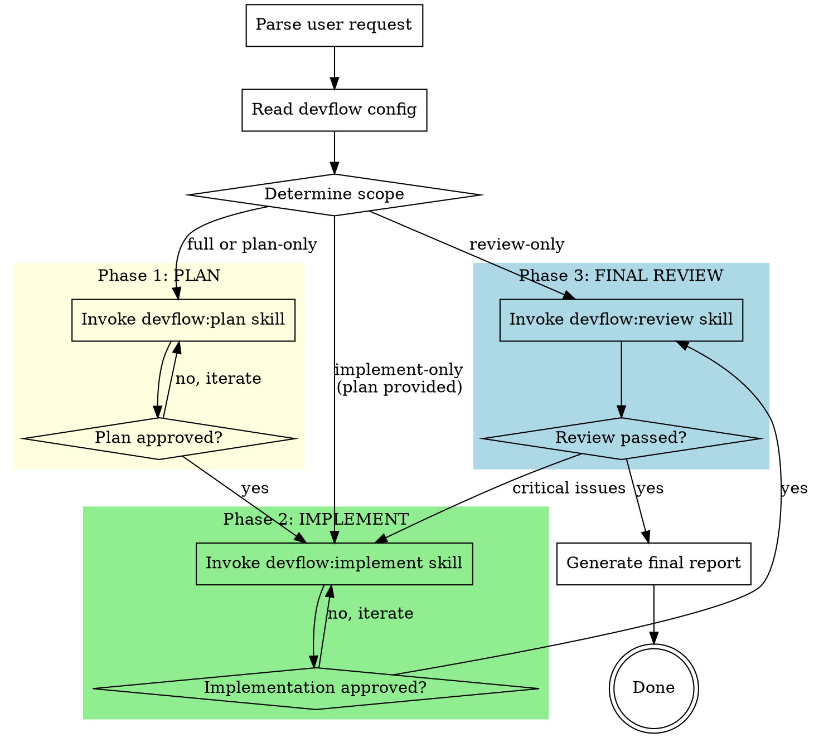

# Devflow: Run

Full development pipeline that orchestrates planning, implementation, and review across multiple AI tools. This is the "one command to rule them all" skill.

Without an execution profile (all `roles.*.agent` empty and `max_passes: 0`) this skill
behaves as before, plus it writes `result.yaml` on every terminal path (see Step 4, Finalize).

## When to Use

- User says "build this feature", "devflow:run", or "run the full pipeline"
- User describes a feature and wants it planned, implemented, and reviewed
- User wants hands-off development with cross-tool quality gates

## Inputs

- **Feature description**: what to build (from user)
- **Autonomy mode**: parsed from user request
  - Default (`attended`): ask user on ambiguity
  - `--unattended` or "don't ask me": never ask, best-effort decisions
  - Partial: "just plan" → only Phase 1, "just implement <plan>" → only Phase 2
- **Config**: `~/.devflow/config.yaml` or `.devflow.yaml`

## The Full Pipeline


```dot
digraph run {
    rankdir=TB;

    "Parse user request" [shape=box];
    "Read devflow config" [shape=box];
    "Determine scope" [shape=diamond];

    subgraph cluster_phase1 {
        label="Phase 1: PLAN";
        style=filled;
        color=lightyellow;
        "Invoke devflow:plan skill" [shape=box];
        "Plan approved?" [shape=diamond];
    }

    subgraph cluster_phase2 {
        label="Phase 2: IMPLEMENT";
        style=filled;
        color=lightgreen;
        "Invoke devflow:implement skill" [shape=box];
        "Implementation approved?" [shape=diamond];
    }

    subgraph cluster_phase3 {
        label="Phase 3: FINAL REVIEW";
        style=filled;
        color=lightblue;
        "Invoke devflow:review skill" [shape=box];
        "Review passed?" [shape=diamond];
    }

    "Generate final report" [shape=box];
    "Done" [shape=doublecircle];

    "Parse user request" -> "Read devflow config";
    "Read devflow config" -> "Determine scope";
    "Determine scope" -> "Invoke devflow:plan skill" [label="full or plan-only"];
    "Determine scope" -> "Invoke devflow:implement skill" [label="implement-only\n(plan provided)"];
    "Determine scope" -> "Invoke devflow:review skill" [label="review-only"];
    "Invoke devflow:plan skill" -> "Plan approved?";
    "Plan approved?" -> "Invoke devflow:implement skill" [label="yes"];
    "Plan approved?" -> "Invoke devflow:plan skill" [label="no, iterate"];
    "Invoke devflow:implement skill" -> "Implementation approved?";
    "Implementation approved?" -> "Invoke devflow:review skill" [label="yes"];
    "Implementation approved?" -> "Invoke devflow:implement skill" [label="no, iterate"];
    "Invoke devflow:review skill" -> "Review passed?";
    "Review passed?" -> "Generate final report" [label="yes"];
    "Review passed?" -> "Invoke devflow:implement skill" [label="critical issues"];
    "Generate final report" -> "Done";
}
```

## Step-by-Step

### Step 0: Parse Request and Config

**Parse the user's request to determine:**

1. **Feature description** — what to build
2. **Scope** — full pipeline, or specific phase(s):
   - "plan this" → Phase 1 only
   - "implement this plan" → Phase 2 only (requires plan file path)
   - "review my changes" → Phase 3 only
   - "build this" / "devflow:run" → all phases
3. **Autonomy** — from request or config:
   - "don't ask me" / "--unattended" → `unattended`
   - Default → `attended`

**Set up the run once:**

```bash
# <inline the $RUNNER locator snippet — see cross-tool-runner.md "Locate the runner">
# (env does not survive between Bash calls, so every step re-runs this guarded locator.)
# Fresh feature -> claim a clean run so no prior feature's session/plan files get resumed. This
# is user-initiated start ONLY — never retry with --force on your own initiative; exit 9 means
# another devflow call is live in this checkout (A3), and only the user can say wipe it anyway.
OUT="$(bash "$RUNNER" dir --fresh)"; DC=$?
if [ "$DC" -eq 9 ]; then
  echo "devflow: another devflow run is active in this checkout ($OUT) — RUN_ACTIVE. Stop, or re-run with --force only if the user explicitly asks to wipe it." >&2
  exit 1
fi
RUN_DIR="$(printf '%s\n' "$OUT" | sed -n 's/^RUN_DIR=//p')"
# devflow-run owns the pipeline: mark it so `deliverable-id --phase review` (Phase 3) knows this
# review IS the same changeset implement just reviewed, without re-deriving that from impl-base
# alone. Removed at Step 4 (Final Report) once the run is done.
: > "$RUN_DIR/pipeline"
```

`RUN_DIR` is deterministic per project (a hash of the repo root under `$HOME/.devflow/run`,
never inside the repo), so every phase — even in a fresh Bash call with no inherited shell
state — reconstructs the same `RUN_DIR` with a plain `bash "$RUNNER" dir` and shares its
files: the plan path, the pre-implementation base, and each phase's review-session id.
`dir --fresh` wipes any old run first so two same-day `devflow:run` features never collide
on one plan file or resume each other's session. The wipe is UNCONDITIONAL — nothing checks
whether another devflow call is still in flight in this checkout, and running it next to a live
call deletes that call's session/verdict/freshness files silently. One pipeline per checkout at
a time; parallel work goes in git worktrees. This is the only place in devflow that passes
`--fresh` as its normal behaviour — Phase 1's `devflow:plan` also starts with `dir --fresh` on
its own default (unbound) path, which is harmless here since nothing is created in between; a
bound execution profile makes `devflow:plan` take its resume-safe plain-`dir` branch instead
(see its own Step 1), so nothing here needs to special-case that.

Read the devflow config (merge three layers, each overriding the next: `.devflow.yaml` →
`~/.devflow/config.yaml` → plugin `config.default.yaml`)
once and note, for the whole run: `backend`, the `reviewer` and `implementer` `model`+`effort`,
`session_reuse`, and `output_dir`. Each phase skill passes `backend`/`model`/`effort` to
`run-external` as flags; `command_path` stays with the runner (never a flag). The reviewing backend is resolved **by host** —
`external_review.from_<host>` first, `backend:` only as the fallback, `none` = internal personas
only; see "Which backend reviews" in `skills/using-devflow/SKILL.md`.
Phase 1 (`devflow:plan`) computes the canonical plan path and records it at
`$RUN_DIR/plan-path`; Phases 2–3 read it back from there.
- **Orchestrator** (you): uses its own model (whatever the host agent runs).

**Execution profile — one `profile-init` call.** This is the only place in devflow that may pass
`--fresh` (the wipe above is this skill's own user-initiated start; every phase skill it calls
attaches with a plain `dir` and never wipes, or takes its own resume-safe branch). Resolve once
for the whole run. `profile-init` is the single place that resolves the profile, runs preflight
when one is declared, and records the result:

```bash
RUN_DIR="$(bash "$RUNNER" dir | sed -n 's/^RUN_DIR=//p')"
CFGC="$(dirname "$RUNNER")/devflow-config.py"
HOST=claude   # <- set this to the tool actually executing this skill (claude|codex|gemini|cursor|opencode) —
              # you know it without asking, same host used for "Which backend reviews". If it
              # cannot be determined, STOP as NEEDS_USER_DECISION instead of guessing — no
              # auto-detection is done on the runner side.

python3 "$CFGC" resolve --project-root . > "$RUN_DIR/resolved-config.json"; RRC=$?
if [ "$RRC" -eq 6 ]; then
  echo "devflow: invalid execution profile in resolved config -> NEEDS_USER_DECISION" >&2
  # STOP: write result.yaml per "Finalize" (Step 4) with status NEEDS_USER_DECISION, then exit.
  exit 1
elif [ "$RRC" -ne 0 ]; then
  echo off > "$RUN_DIR/profile-active"
else
  bash "$RUNNER" profile-init --roles-file "$RUN_DIR/resolved-config.json" --host "$HOST" \
    > "$RUN_DIR/profile-init-out.txt" 2>&1
  PI_RC=$?
  [ -s "$RUN_DIR/profile-init-out.txt" ] && cat "$RUN_DIR/profile-init-out.txt"   # fallbacks[] + profile=<state> max_passes=<n> echoed into the report
  case "$PI_RC" in
    0) : ;;
    6|4|5|7)
      echo "devflow: profile-init failed ($PI_RC) -> NEEDS_USER_DECISION: $(cat "$RUN_DIR/profile-init-out.txt")" >&2
      exit 1 ;;
    *)
      echo "devflow: profile-init failed ($PI_RC) -> FAILED: $(cat "$RUN_DIR/profile-init-out.txt")" >&2
      exit 1 ;;
  esac
fi
PROFILE="$(cat "$RUN_DIR/profile-active" 2>/dev/null || echo off)"
echo "Execution profile: $PROFILE"
```

Each phase skill invoked below re-runs this same `profile-init` at its own Step 1 — idempotent
and cheap, so no special-casing needed when a phase is entered standalone too. `passes init` is
NOT called here: each phase computes its own deliverable id once it is stable (plan path /
impl-base) via `deliverable-id` and calls `init` itself — see each skill's Step 1/3.

**Create a TodoWrite/todo_list with phases to track progress.**

### Step 1: Phase 1 — PLAN (if in scope)

**Invoke the `devflow:plan` skill.** This skill handles:
- Superpowers brainstorming and writing-plans
- External cross-tool review of the plan
- Iteration until plan is approved

**Output**: Plan file at the canonical path recorded in `$RUN_DIR/plan-path` (under `output_dir`, not `docs/superpowers/`).

**Session artifact**: After plan review completes, the session file is at
`$RUN_DIR/plan-review.session`. This carries context to Phase 2.

**In attended mode**: After plan is finalized, present summary to user:
> "Phase 1 complete. Plan saved to `<path>`. External review: APPROVED after N rounds. Proceed to implementation?"

**In unattended mode**: Proceed directly to Phase 2.

### Step 2: Phase 2 — IMPLEMENT (if in scope)

**Invoke the `devflow:implement` skill.** This skill handles:
- Superpowers subagent-driven-development or executing-plans
- External cross-tool review of implementation
- Iteration until implementation is approved

**Input**: Plan file from Phase 1 (or user-provided path)

**Session continuity**: `devflow:implement` resumes `$RUN_DIR/plan-review.session` (same `RUN_DIR`, re-derived from `bash "$RUNNER" dir` — no shell inheritance needed) for code review — the reviewer already knows the plan and prior feedback.

**Output**: Code changes in working directory + review report

**In attended mode**: After implementation is approved, present summary:
> "Phase 2 complete. Implementation reviewed and approved. N files changed. Proceed to final review?"

**In unattended mode**: Proceed directly to Phase 3.

### Step 3: Phase 3 — FINAL REVIEW (if in scope)

**No double review — profile path only.** This skip is additive execution-profile behaviour,
not a change to the default pipeline: gate the whole check on the profile being active (a role
bound, or `max_passes>0`); on the plain default path, always invoke `devflow:review` below,
unconditionally, exactly as before profiles existed.

```bash
RUN_DIR="$(bash "$RUNNER" dir | sed -n 's/^RUN_DIR=//p')"
PROFILE="$(cat "$RUN_DIR/profile-active" 2>/dev/null || echo off)"
SKIP_PHASE3=0
if [ "$PROFILE" = active ]; then
  IMPL_BASE="$(cat "$RUN_DIR/impl-base" 2>/dev/null)"
  DELIVERABLE="$(cat "$RUN_DIR/deliverable" 2>/dev/null)"
  # Read the completion record (A10), not a freshness .tree snapshot — an internal-only Phase 2
  # (no external call) still writes `passes complete`, so it must still be able to skip Phase 3.
  ST="$(bash "$RUNNER" passes status --deliverable "$DELIVERABLE")"   # used=<u> max=<m> open=<...> done=<yes|no> scope=<digest|->
  DONE_SCOPE="$(printf '%s\n' "$ST" | sed -n 's/.*scope=\([^ ]*\).*/\1/p')"
  CURRENT_SCOPE="$(bash "$RUNNER" scope-digest --base "$IMPL_BASE" 2>/dev/null)"
  # "done=yes" is the completion record's own literal marker (A10) — match it as a substring so
  # this never depends on exactly where the runner places the field.
  case "$ST" in
    *done=yes*) DONE=yes ;;
    *)          DONE=no ;;
  esac
  if [ "$DONE" = yes ] && [ -n "$DONE_SCOPE" ] && [ "$DONE_SCOPE" = "$CURRENT_SCOPE" ]; then
    echo "devflow: deliverable $DELIVERABLE already reviewed and completed in implement, tree unchanged since — reusing that report, skipping Phase 3's review."
    SKIP_PHASE3=1
  fi
fi
```

If `SKIP_PHASE3=1`: reuse Phase 2's report; go straight to the final verifier (if a verifier is
bound, per `effective-roles.json`) and Step 4's result contract — do not invoke `devflow:review`
again on the same reviewed deliverable.

Otherwise, **invoke the `devflow:review` skill.** This skill handles:
- Internal code review (superpowers)
- External cross-tool review
- Combined report

**This is the final review.** What matters is the findings you still consider worth fixing —
not a reviewer's raw verdict token. On open findings:
- **attended**: Present to user for decision
- **unattended**: the `devflow:review` skill's **Iteration** section owns the fix → re-review
  loop (each round re-runs every persona plus the external reviewer, if one is configured, with
  a delta brief). No round cap; it stops as `NEEDS_USER_DECISION` when a round's fixes produce
  new findings instead, or a fix would break the pinned scope. Do not restate or override
  those rules here.

**`NEEDS_USER_DECISION` propagates up.** It is neither approval nor failure: end the run,
report it as the pipeline status with the exact finding IDs and the decision needed, and do
not start another phase or another round around it.

### Step 4: Final Report

**Execution profile — final verifier.** Read `VER_AGENT` fresh from
`$RUN_DIR/effective-roles.json` (never a Step 0 shell variable). If non-empty, before writing the
report call `Agent(subagent_type=<VER_AGENT>)` one last time (even when Step 3 was
skipped as a double review): run tests/lint, diff vs the plan line by line, report commands +
exit codes + `git rev-parse HEAD`; save to `$RUN_DIR/run-verify.txt`. Not a review pass.

Generate a comprehensive report summarizing the entire pipeline:

```markdown
# Devflow Report: <feature name>

**Date**: YYYY-MM-DD
**Autonomy**: attended / unattended
**Orchestrator**: <current tool>
**External reviewer**: <tool name>

## Phase 1: Planning
- **Status**: Complete / NEEDS_USER_DECISION
- **Plan**: `<path>`
- **Rounds**: N (your own recollection — no on-disk counter)
- **Blocking**: N (resolved) / N open
- **Not actioned**: N deferred + N out-of-scope — see the phase report's "Not actioned" table
- **Duration**: ~Xm

## Phase 2: Implementation
- **Status**: Complete / NEEDS_USER_DECISION
- **Files changed**: N
- **Rounds**: N (your own recollection — no on-disk counter)
- **Blocking**: N (resolved) / N open
- **Not actioned**: N deferred + N out-of-scope — see the phase report's "Not actioned" table
- **Duration**: ~Xm

## Phase 3: Final Review
- **Status**: Approved / Approved with notes / NEEDS_USER_DECISION
- **Rounds**: N (your own recollection — no on-disk counter)
- **Blocking**: N (resolved) / N open
- **Not actioned**: N deferred + N out-of-scope — see the review report's
  "Not actioned" table for each finding, why it was not fixed, and the proposed next step
- **Report**: `<path>`

## Summary
<1-2 sentence summary of what was built and its status>

## Next Steps
- Review changes: `git diff --stat`
- Run tests: `<test command from project>`
- Commit when satisfied
```

Create the output directory and save:

```bash
mkdir -p <output_dir>
```

Save to `<output_dir>/YYYY-MM-DD-<feature>-report.md`.

**Result contract (Finalize, always).** This is the single Finalize block every stop in this
skill refers to (preflight failure in Step 0, and each phase's own Finalize when a phase stops
before reaching here — `NEEDS_USER_DECISION` propagates up rather than being re-finalized).
Write `$RUN_DIR/result.yaml` atomically via `result-write` and print the same block as the
**last thing** in the final message — profile or not. Echo any `fallbacks[]` from
`effective-roles.json` into the report first. Remove `$RUN_DIR/pipeline` here — the run owns it
and it must not leak into the next feature's run:

```bash
RUN_DIR="$(bash "$RUNNER" dir | sed -n 's/^RUN_DIR=//p')"
IMPL_BASE="$(cat "$RUN_DIR/impl-base" 2>/dev/null)"
DELIVERABLE="$(cat "$RUN_DIR/deliverable" 2>/dev/null)"
MAX_PASSES="$(cat "$RUN_DIR/max-passes" 2>/dev/null || echo 0)"
ST="$(bash "$RUNNER" passes status --deliverable "$DELIVERABLE" 2>/dev/null)"
USED="$(printf '%s\n' "$ST" | sed -n 's/^used=\([0-9]*\).*/\1/p')"
# scope_digest comes from `passes status`'s recorded completion (A10); only recompute directly
# when nothing has completed yet (profile off, or no round finished).
SCOPE_DIGEST="$(printf '%s\n' "$ST" | sed -n 's/.*scope=\([^ ]*\).*/\1/p')"
[ -n "$SCOPE_DIGEST" ] && [ "$SCOPE_DIGEST" != "-" ] || SCOPE_DIGEST="$(bash "$RUNNER" scope-digest --base "$IMPL_BASE" 2>/dev/null)"
REVISION_REVIEWED="$(cat "$RUN_DIR/impl-reviewed.digest" 2>/dev/null)"
rm -f "$RUN_DIR/pipeline"
```

```yaml
result_contract: 1
status: DONE   # or NEEDS_USER_DECISION / FAILED
deliverable: <DELIVERABLE, e.g. impl-<IMPL_BASE>>
scope_digest: <SCOPE_DIGEST>
revision_reviewed: <REVISION_REVIEWED — the digest recorded before the last reviewer call actually read>
revision_final: <git rev-parse HEAD after the last fix wave>
passes: { used: <USED, 0 if profile inactive>, max: <MAX_PASSES> }
evidence:
  - { kind: verifier, ref: <RUN_DIR>/run-verify.txt, ref_type: path, summary: <one line> }
  - { kind: external_review, ref: <RUN_DIR>/final-review-verdict.txt or impl-review-verdict.txt, ref_type: path, summary: <one line> }
blockers: []   # or [{id: <finding id>, summary: <one line>}, ...] when status is NEEDS_USER_DECISION
artifacts_dir: <RUN_DIR>
```

Write it atomically — never a bare redirect (A6):

```bash
printf '%s' "$BLOCK" | bash "$RUNNER" result-write --path "$RUN_DIR/result.yaml"
```

(`$BLOCK` is the YAML above with the placeholders filled in from the variables computed just before it.)

## Partial Execution Examples

| User says | Phases executed |
|-----------|----------------|
| "devflow:run — add caching for /skills" | 1 → 2 → 3 |
| "devflow:plan — add caching for /skills" | 1 only |
| "devflow:implement docs/plans/caching.md" | 2 → 3 |
| "devflow:review my staged changes" | 3 only |
| "devflow:run --unattended — add caching" | 1 → 2 → 3 (no user prompts) |

## Error Handling

| Error | Action |
|-------|--------|
| External tool CLI not found | Tell user to install it, suggest config change |
| External tool returns error | Retry once, then show error to user |
| External tool timeout | ~8–10 min hard-cap (`run-external`'s internal poll loop) → kill, surface last event, escalate |
| Plan file not found (Phase 2) | Ask user for path |
| Config file invalid YAML | Use defaults, warn user |
| Superpowers not installed | Tell user to install superpowers first |

## Key Rules

- **Phases are sequential** — plan before implement, implement before final review
- **Each phase is self-contained** — can run any phase independently
- **Never skip external review** — it's the core value proposition
- **Don't auto-commit** — changes stay in working directory
- **Report everything** — save reports for audit trail
- **Superpowers skills do the heavy lifting** — devflow orchestrates between tools
- **Model tiers matter** — reviewer effort ≥ implementer (claude: `max` review / `high` impl; codex: `high` for both)
- **RUN_DIR is deterministic per project** (a hash of the repo root under `$HOME/.devflow/run` — deliberately not `$TMPDIR`, a write-mode call's writable root; `DEVFLOW_RUN_HOME` overrides it, for the test harness); every phase reconstructs it with `bash "$RUNNER" dir` and shares its files (plan path, impl base, session ids) — no shell inheritance. Config is read from `.devflow.yaml` and passed to `run-external` as flags; the codex binary is resolved by the runner from trusted config only
- **External calls are non-blocking** — `run-external` backgrounds its own child process and polls internally; no 2-min-timeout deaths. On Claude Code, launch the `run-external` call itself with the Bash tool's `run_in_background: true` rather than polling in a loop (see cross-tool-runner.md's async-execution guidance)
- **Session reuse saves tokens** — ~20k tokens saved per resumed iteration
- **Unbound-path cost** — even with no role bound, one review round still costs (personas + external) reviewer passes against `max_passes`; there is no free lane
